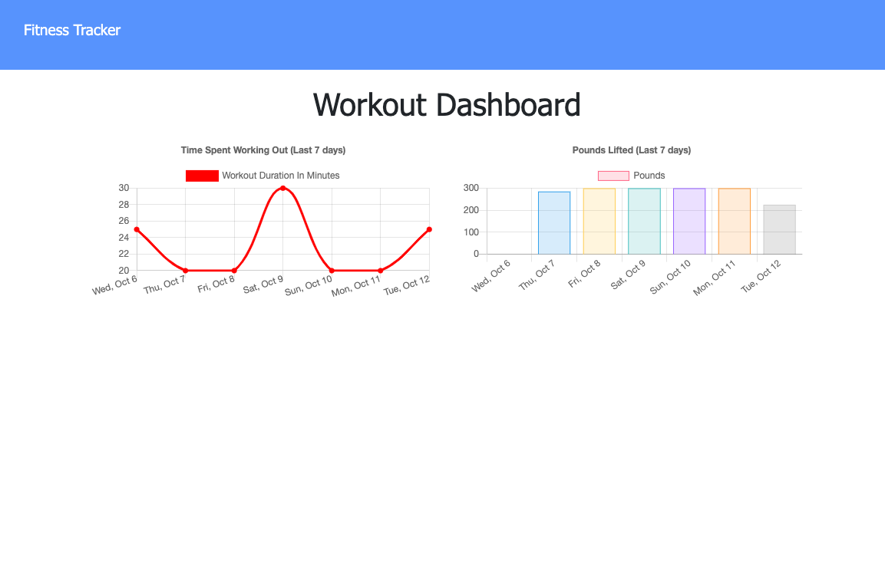

# workout-tracker

[Link to Deployed Site]()

## Table of Contents
- [Description](#Description)
- [Usage](#Usage)
- [Screenshots](#Screenshots)
- [License](#License)
- [Languages](#Languages)
- [Questions](#Questions)

## Description
This application is for the user to keep track of their workouts by quickly being able view, create and track exercises/workouts. It keeps track of the name, type, weight, sets, reps, and duration of exercise and possibly the distance if necessary.It stores data in a Mongo database with a Mongoose schema and handles all of the routes through express.

## Usage
To track your workouts and keep track of your progress in a weekly dashboard.

## Screenshot

-------

## License
MIT 

## Languages
JavaScript, HTML, CSS, Mongoose

## Questions
Please contact me at lauraRweiner@gmail.com if you have any questions or suggestions.